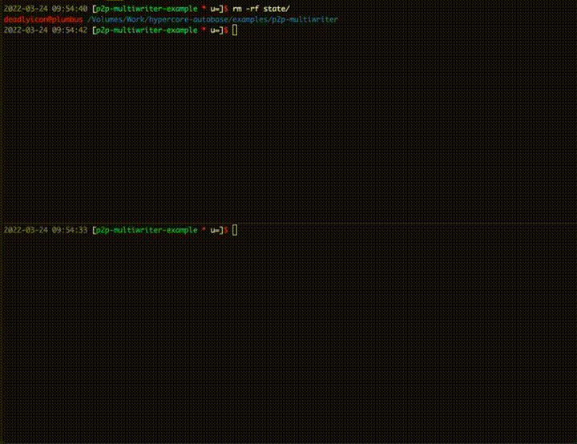

# peer to peer multiwriter example

This example aims to show how to setup a basic
peer-to-peer mutliwriter using Hypercore 10.



The `chat-cli.js` "app" runs in the terminal as
one of N users in the `users.js` file.

When you run `node chat-cli.js saimon` you can
think of that process as an "app" that holds
both the public and private keys for `saimon`
but only knows the publicKeys for all the other
users.


## Exercise

In two terminals run the following commands:

```bash
# terminal 1
node chat-cli.js saimon
# terminal 2
node chat-cli.js paul
```

A full screen terminal app should spawn and begin trying to
join a hyperswarm.

Each instane of chat-cli.js stores its hypercores in `./state/${username}`
so you should be able to author new chat messages before connecting
to and syncing across the swarm.
